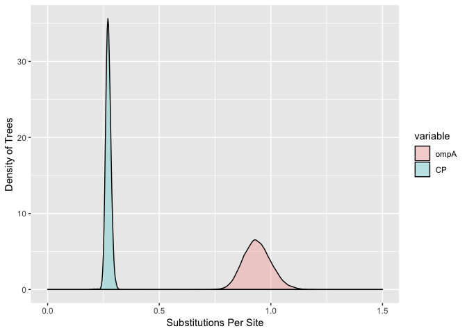
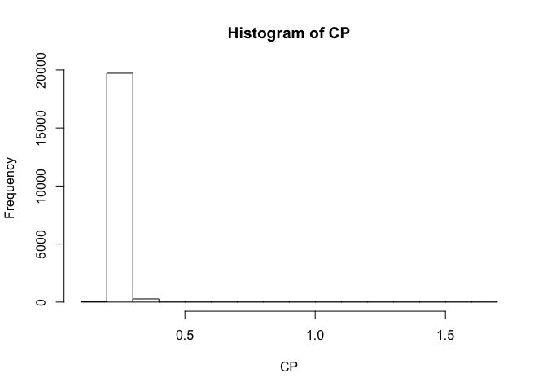
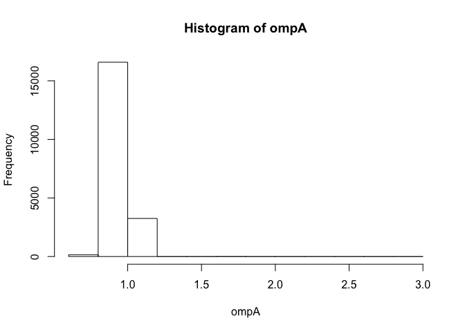
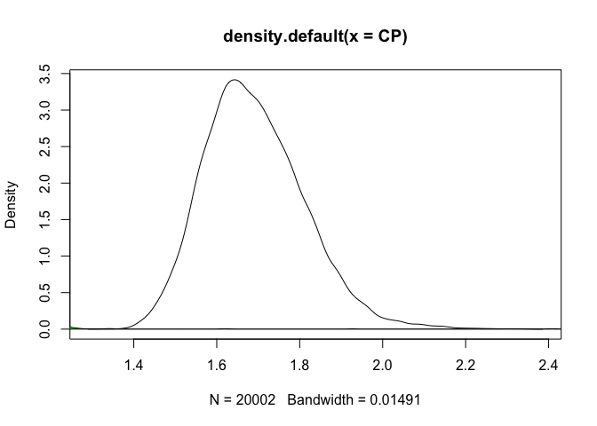

treelength\_One\_Outgroup.R
================
Amy
Mon Apr 8 19:01:50 2019

``` r
library(ape)
library(phytools)
```

    ## Loading required package: maps

``` r
library(ggplot2)
library(reshape2)

###################################################################
#ompA
ompA_trees<-read.nexus(file="One_outgroup/ompA1out1.nex")
ompA_treelength<-numeric()
for (i in 1:length(ompA_trees)){
  ompA_treelength[i]<-sum(ompA_trees[[i]]$edge.length)
}

ompA_trees2<-read.nexus(file="One_outgroup/ompA1out2.nex")
ompA_treelength2<-numeric()
for (i in 1:length(ompA_trees2)){
  ompA_treelength2[i]<-sum(ompA_trees2[[i]]$edge.length)
}
#sanity check for expected differences
mean(ompA_treelength2)
```

    ## [1] 1.0041

``` r
mean(ompA_treelength)
```

    ## [1] 1.0055

``` r
#Concatenate lengths from the two runs
ompA<-c(ompA_treelength,ompA_treelength2)
#View(ompA)

###################################################################
#CP
CP_trees<-read.nexus(file="One_outgroup/CP_trees1.nex")
CP_treelength<-numeric()
for (i in 1:length(CP_trees)){
  CP_treelength[i]<-sum(CP_trees[[i]]$edge.length)
}

CP_trees2<-read.nexus(file="One_outgroup/CP_trees2.nex")
CP_treelength2<-numeric()
for (i in 1:length(CP_trees2)){
  CP_treelength2[i]<-sum(CP_trees2[[i]]$edge.length)
}
#sanity check for expected differences
mean(CP_treelength2)
```

    ## [1] 1.695029

``` r
mean(CP_treelength)
```

    ## [1] 1.687781

``` r
# Concatenate lengths from the two runs
CP<-c(CP_treelength,CP_treelength2)
#View(CP)


######################################################################
#Analysis:
Rates<-data.frame(ompA, CP)
head(Rates)
```

    ##       ompA       CP
    ## 1 1.620000 1.656377
    ## 2 4.324336 1.655845
    ## 3 2.402805 1.557088
    ## 4 2.299343 1.625642
    ## 5 1.927038 1.600637
    ## 6 1.288854 1.639293

``` r
data<-melt(Rates)
```

    ## No id variables; using all as measure variables

``` r
head(data)
```

    ##   variable    value
    ## 1     ompA 1.620000
    ## 2     ompA 4.324336
    ## 3     ompA 2.402805
    ## 4     ompA 2.299343
    ## 5     ompA 1.927038
    ## 6     ompA 1.288854

``` r
ggplot(data,aes(x=value, fill=variable)) + 
  geom_density(alpha=0.25) +
  xlim(0.5,2.5)
```

    ## Warning: Removed 4 rows containing non-finite values (stat_density).

<!-- -->

``` r
hist(CP)
```

<!-- -->

``` r
mean(CP,na.rm=TRUE)
```

    ## [1] 1.691405

``` r
mean(ompA)
```

    ## [1] 1.0048

``` r
hist(ompA)
```

<!-- -->

``` r
densityCP<-density(CP)
xx <- densityCP$x
dx <- xx[2L] - xx[1L]  ## spacing / bin size
yy <- densityCP$y
C <- sum(yy) * dx  ## sum(yy * dx)
C
```

    ## [1] 1.000978

``` r
densityompA<-density(ompA)
xx <- densityompA$x
dx <- xx[2L] - xx[1L]  ## spacing / bin size
yy <- densityompA$y
C <- sum(yy) * dx  ## sum(yy * dx)
C
```

    ## [1] 1.000827

``` r
plot(densityCP)
polygon(densityompA, col="green", border="black")
```

<!-- -->
