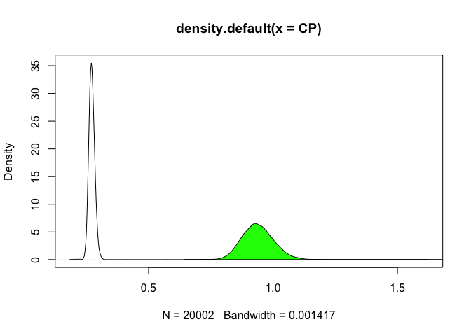

treelength\_One\_Outgroup.R
================
Amy
Thu Apr 11 17:43:33 2019

``` r
library(ape)
library(phytools)
```

    ## Loading required package: maps

``` r
library(ggplot2)
library(reshape2)

###################################################################
#ompA
ompA_trees<-read.nexus(file="One_outgroup/ompA.nex.run1.t")
#View(ompA_trees)
ompA_treelength<-numeric()
for (i in 1:length(ompA_trees)){
  ompA_treelength[i]<-sum(ompA_trees[[i]]$edge.length)
}

ompA_trees2<-read.nexus(file="One_outgroup/ompA.nex.run2.t")
ompA_treelength2<-numeric()
for (i in 1:length(ompA_trees2)){
  ompA_treelength2[i]<-sum(ompA_trees2[[i]]$edge.length)
}
#sanity check for expected differences
mean(ompA_treelength2)
```

    ## [1] 0.9387349

``` r
mean(ompA_treelength)
```

    ## [1] 0.9408079

``` r
#Concatenate lengths from the two runs
ompA<-c(ompA_treelength,ompA_treelength2)
#View(ompA)

###################################################################
#CP
CP_trees<-read.nexus(file="One_outgroup/CP_MAFFT.nex.run1.t")
CP_treelength<-numeric()
for (i in 1:length(CP_trees)){
  CP_treelength[i]<-sum(CP_trees[[i]]$edge.length)
}

CP_trees2<-read.nexus(file="One_outgroup/CP_MAFFT.nex.run2.t")
CP_treelength2<-numeric()
for (i in 1:length(CP_trees2)){
  CP_treelength2[i]<-sum(CP_trees2[[i]]$edge.length)
}
#sanity check for expected differences
mean(CP_treelength2)
```

    ## [1] 0.2717347

``` r
mean(CP_treelength)
```

    ## [1] 0.2724249

``` r
# Concatenate lengths from the two runs
CP<-c(CP_treelength,CP_treelength2)
#View(CP)


######################################################################
#Analysis:
Rates<-data.frame(ompA, CP)
head(Rates)
```

    ##       ompA        CP
    ## 1 1.620000 1.6200000
    ## 2 2.774153 0.3320822
    ## 3 2.930003 0.5716360
    ## 4 1.802383 0.3057139
    ## 5 2.168095 0.2096357
    ## 6 1.079065 0.2285718

``` r
data<-melt(Rates)
```

    ## No id variables; using all as measure variables

``` r
head(data)
```

    ##   variable    value
    ## 1     ompA 1.620000
    ## 2     ompA 2.774153
    ## 3     ompA 2.930003
    ## 4     ompA 1.802383
    ## 5     ompA 2.168095
    ## 6     ompA 1.079065

``` r
ggplot(data,aes(x=value, fill=variable)) + 
  geom_density(alpha=0.25) +
  xlab("Substitutions Per Site")+
  ylab("Density of Trees")+
  xlim(0,1.5)
```

    ## Warning: Removed 12 rows containing non-finite values (stat_density).

<!-- -->

``` r
hist(CP)
```

<!-- -->

``` r
mean(CP,na.rm=TRUE)
```

    ## [1] 0.2720798

``` r
mean(ompA)
```

    ## [1] 0.9397714

``` r
hist(ompA)
```

<!-- -->

``` r
densityCP<-density(CP)
xx <- densityCP$x
dx <- xx[2L] - xx[1L]  ## spacing / bin size
yy <- densityCP$y
C <- sum(yy) * dx  ## sum(yy * dx)
C
```

    ## [1] 1.015654

``` r
densityompA<-density(ompA)
xx <- densityompA$x
dx <- xx[2L] - xx[1L]  ## spacing / bin size
yy <- densityompA$y
C <- sum(yy) * dx  ## sum(yy * dx)
C
```

    ## [1] 1.001113

``` r
plot(densityCP)
polygon(densityompA, col="green", border="black")
```

<!-- -->

``` r
t.test(ompA, CP, paired=TRUE, conf.level=0.98)
```

    ## 
    ##  Paired t-test
    ## 
    ## data:  ompA and CP
    ## t = 1408.7, df = 20001, p-value < 2.2e-16
    ## alternative hypothesis: true difference in means is not equal to 0
    ## 98 percent confidence interval:
    ##  0.6665889 0.6687943
    ## sample estimates:
    ## mean of the differences 
    ##               0.6676916
