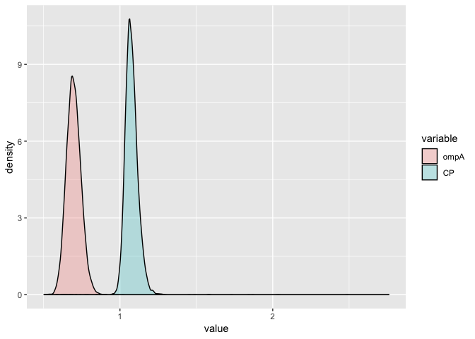
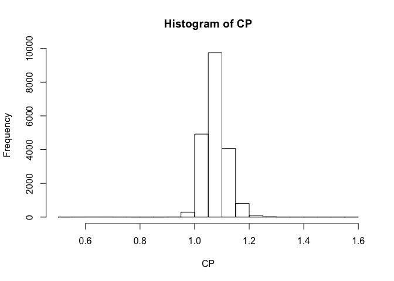
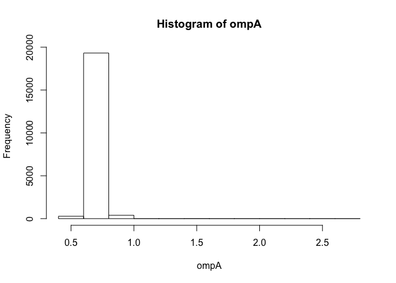

treelength\_noOutgroup.R
================
Amy
Mon Apr 8 16:06:46 2019

``` r
library(ape)
library(phytools)
```

    ## Loading required package: maps

``` r
library(ggplot2)
library(reshape2)

###################################################################
#ompA
ompA_trees<-read.nexus(file="Without_outgroup/ompA_trees1.nex")
ompA_treelength<-numeric()
for (i in 1:length(ompA_trees)){
  ompA_treelength[i]<-sum(ompA_trees[[i]]$edge.length)
}

ompA_trees2<-read.nexus(file="Without_outgroup/ompA_trees2.nex")
ompA_treelength2<-numeric()
for (i in 1:length(ompA_trees2)){
  ompA_treelength2[i]<-sum(ompA_trees2[[i]]$edge.length)
}
#sanity check for expected differences
mean(ompA_treelength2)
```

    ## [1] 0.699582

``` r
mean(ompA_treelength)
```

    ## [1] 0.696573

``` r
#Concatenate lengths from the two runs
ompA<-c(ompA_treelength,ompA_treelength2)
#View(ompA)

###################################################################
#CP
CP_trees<-read.nexus(file="Without_outgroup/CP_trees1.nex")
CP_treelength<-numeric()
for (i in 1:length(CP_trees)){
  CP_treelength[i]<-sum(CP_trees[[i]]$edge.length)
}

CP_trees2<-read.nexus(file="Without_outgroup/CP_trees2.nex")
CP_treelength2<-numeric()
for (i in 1:length(CP_trees2)){
  CP_treelength2[i]<-sum(CP_trees2[[i]]$edge.length)
}
#sanity check for expected differences
mean(CP_treelength2)
```

    ## [1] 1.075549

``` r
mean(CP_treelength)
```

    ## [1] 1.076315

``` r
# Concatenate lengths from the two runs
CP<-c(CP_treelength,CP_treelength2)
#View(CP)


######################################################################
#Analysis:
Rates<-data.frame(ompA, CP)
head(Rates)
```

    ##        ompA        CP
    ## 1 1.5800000 1.0862207
    ## 2 2.7599218 1.0847291
    ## 3 1.7301715 1.0843715
    ## 4 2.0284727 1.0837141
    ## 5 1.8433227 1.0829587
    ## 6 0.9788562 0.9948675

``` r
data<-melt(Rates)
```

    ## No id variables; using all as measure variables

``` r
head(data)
```

    ##   variable     value
    ## 1     ompA 1.5800000
    ## 2     ompA 2.7599218
    ## 3     ompA 1.7301715
    ## 4     ompA 2.0284727
    ## 5     ompA 1.8433227
    ## 6     ompA 0.9788562

``` r
ggplot(data,aes(x=value, fill=variable)) + 
  geom_density(alpha=0.25)
```

<!-- -->

``` r
hist(CP)
```

<!-- -->

``` r
mean(CP,na.rm=TRUE)
```

    ## [1] 1.075932

``` r
mean(ompA)
```

    ## [1] 0.6980775

``` r
hist(ompA)
```

<!-- -->
