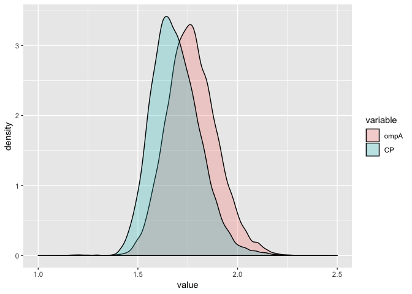
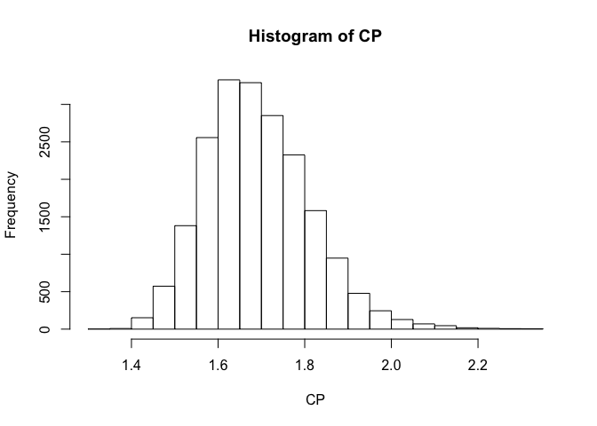
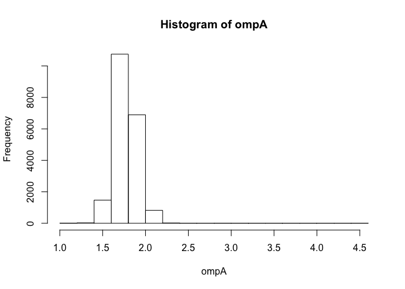

treelength\_share.R
================
Amy
Mon Apr 8 14:11:35 2019

``` r
library(ape)
library(phytools)
```

    ## Loading required package: maps

``` r
library(ggplot2)
library(reshape2)

###################################################################
#ompA
ompA_trees<-read.nexus(file="ompA_trees1.nex")
ompA_treelength<-numeric()
for (i in 1:length(ompA_trees)){
  ompA_treelength[i]<-sum(ompA_trees[[i]]$edge.length)
}

ompA_trees2<-read.nexus(file="ompA_trees2.nex")
ompA_treelength2<-numeric()
for (i in 1:length(ompA_trees2)){
  ompA_treelength2[i]<-sum(ompA_trees2[[i]]$edge.length)
}
#sanity check for expected differences
mean(ompA_treelength2)
```

    ## [1] 1.769525

``` r
mean(ompA_treelength)
```

    ## [1] 1.774128

``` r
#Concatenate lengths from the two runs
ompA<-c(ompA_treelength,ompA_treelength2)
#View(ompA)

###################################################################
#CP
CP_trees<-read.nexus(file="CP_trees1.nex")
CP_treelength<-numeric()
for (i in 1:length(CP_trees)){
  CP_treelength[i]<-sum(CP_trees[[i]]$edge.length)
}

CP_trees2<-read.nexus(file="CP_trees2.nex")
CP_treelength2<-numeric()
for (i in 1:length(CP_trees2)){
  CP_treelength2[i]<-sum(CP_trees2[[i]]$edge.length)
}
#sanity check for expected differences
mean(CP_treelength2)
```

    ## [1] 1.695029

``` r
mean(CP_treelength)
```

    ## [1] 1.687781

``` r
# Concatenate lengths from the two runs
CP<-c(CP_treelength,CP_treelength2,NA,NA)
#View(CP)


######################################################################
#Analysis:
Rates<-data.frame(ompA, CP)
head(Rates)
```

    ##       ompA       CP
    ## 1 1.740000 1.656377
    ## 2 4.494645 1.655845
    ## 3 2.955226 1.557088
    ## 4 2.870168 1.625642
    ## 5 2.443038 1.600637
    ## 6 1.942515 1.639293

``` r
data<-melt(Rates)
```

    ## No id variables; using all as measure variables

``` r
head(data)
```

    ##   variable    value
    ## 1     ompA 1.740000
    ## 2     ompA 4.494645
    ## 3     ompA 2.955226
    ## 4     ompA 2.870168
    ## 5     ompA 2.443038
    ## 6     ompA 1.942515

``` r
ggplot(data,aes(x=value, fill=variable)) + 
  geom_density(alpha=0.25) +
  xlim(1,2.5)
```

    ## Warning: Removed 6 rows containing non-finite values (stat_density).

<!-- -->

``` r
hist(CP)
```

<!-- -->

``` r
mean(CP,na.rm=TRUE)
```

    ## [1] 1.691405

``` r
mean(ompA)
```

    ## [1] 1.771827

``` r
hist(ompA)
```

<!-- -->
